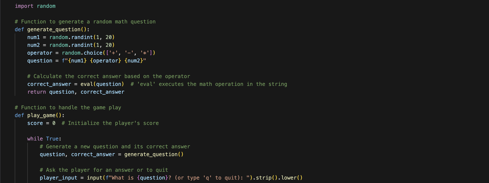
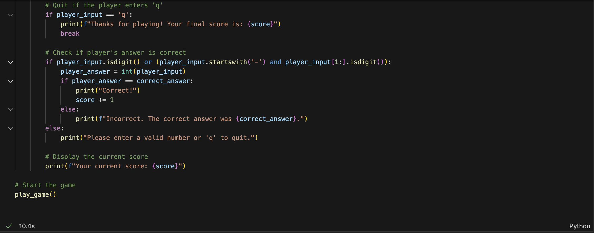
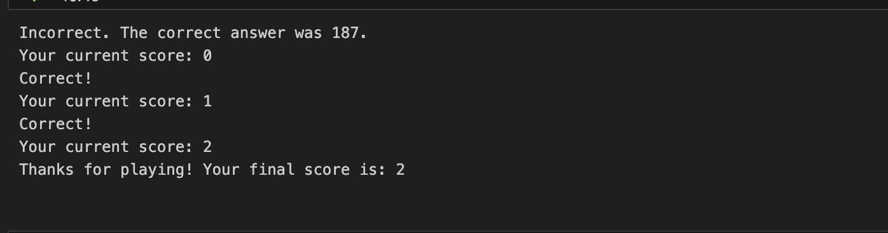
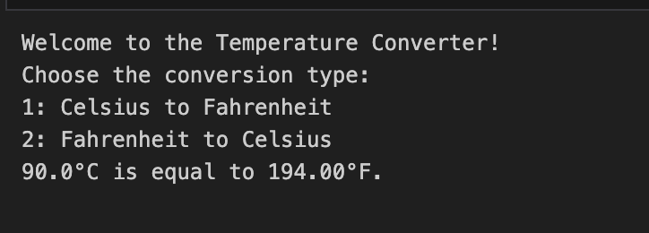
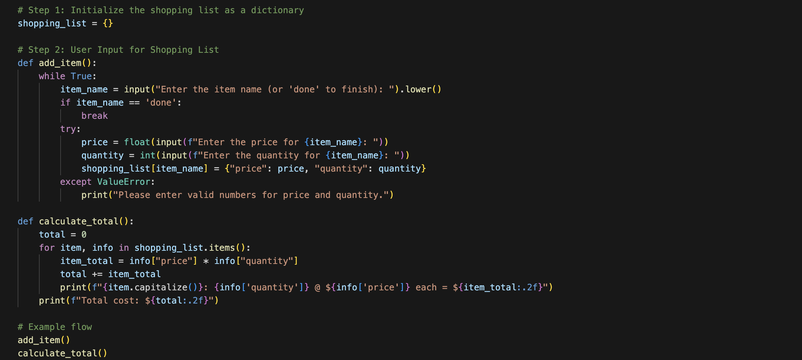
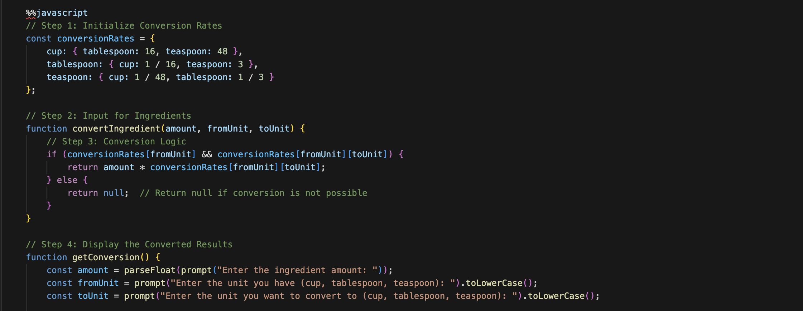
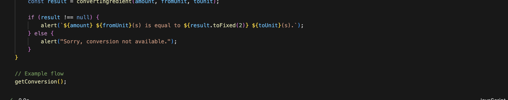



## SUMMARY OF 3.1 ##
 
### - Variables mainly are used to store data values and they can be accessed throughout the problems. ###
### - These variables also tend to change over time(say you want to change what you store in the variable) ###
### - variables cannot have a space in between them an example is my_name = Lalita as you can see there is an underscore in the variable to not have a space in the variable ###
### - Operations combin two strings and Repetition repeats strings over and over again ###

3.1 was mainly about variables and assignments so for the first popcorn hack I changed it up by having a variable of my dictionary and in the dictionary it was types of fruits. With the myDictionary[2] it outputs the second thing in the dictionary which in this case would be apples. And this code was in javascript  

The next popcorn hack was a math quiz. I used the same elements as them but for this one I decided to use different loops and  I used python. In theirs they just used the if and else statement but I decided to add a while loop to my code, as they got the answers right they got more chances to do the math quiz. 

The next popcorn hack was to make a temperature convertor. One thing I did differently to learn more about variables and assignments was to give the users the choice of whether they want to convert from celcius to farienheit or the other way around. 

This was the first homework hack and it was to make a shopping list and I decided to add something extra by adding the amount of quantity each item is and this way it can give a total score of the price you dont have to type in tooth brush twice you can just say 2 toothbrushes 

The last homework hack is in javascript and I added something extra by saying if the conversion they gave was not in the system then the computer will have to output that it is not avalible rather than an error sign. 

