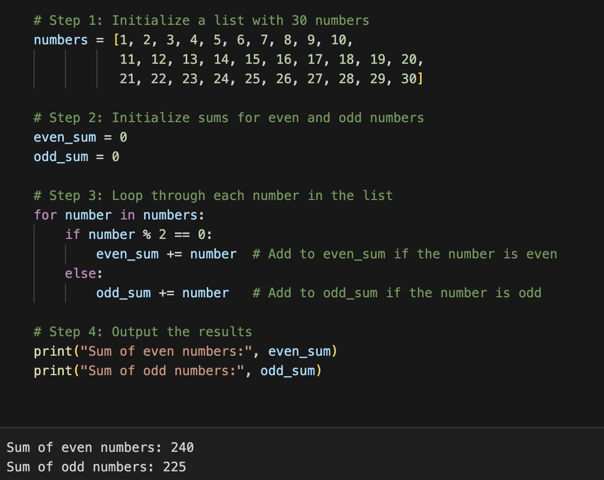
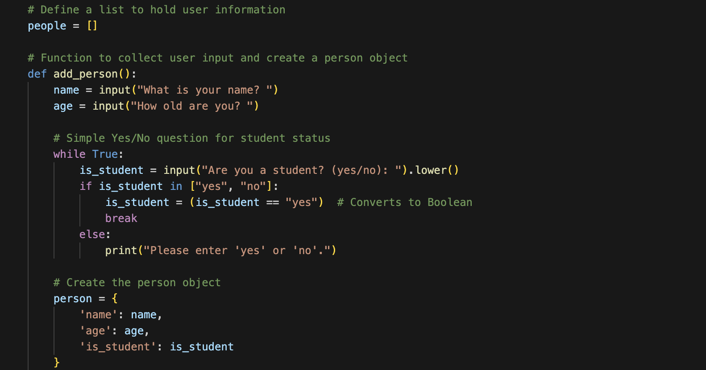
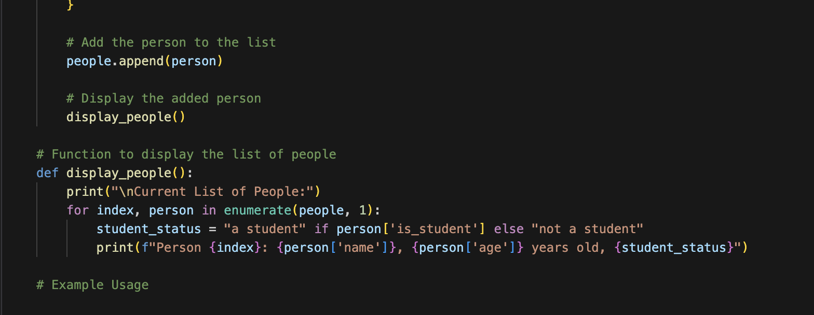
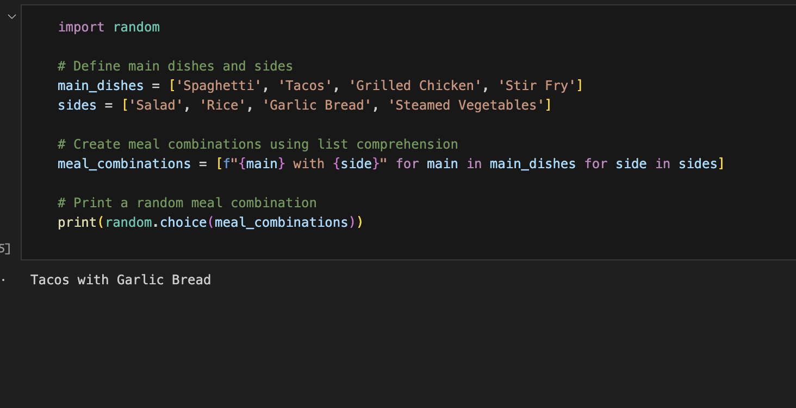



 For the first hack I was able to sort the numbers in the list and then calculate the sum of all the even numbers and all the odd numbers

The hack I liked the most and this was because I was able to choose how I created the person using different questions that atest to their different attributes and it is cool seeing how this the exact way of how systems store their information. 

 This was one of the popcorn hacks and it was to make a random meal combination. 