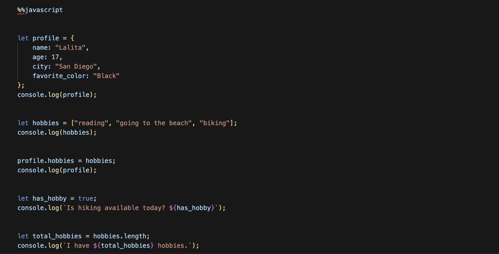
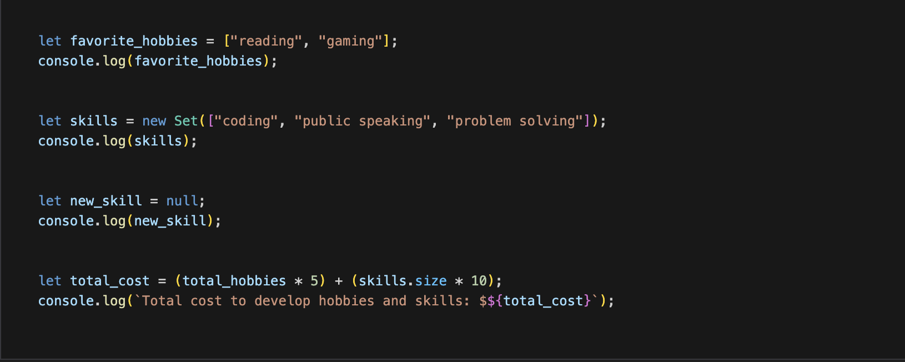
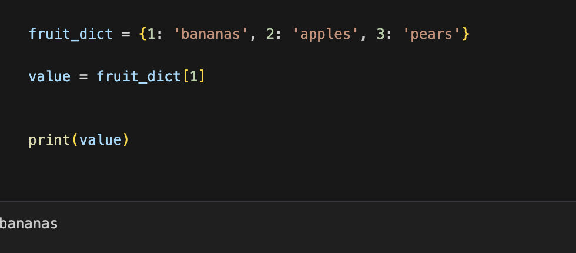
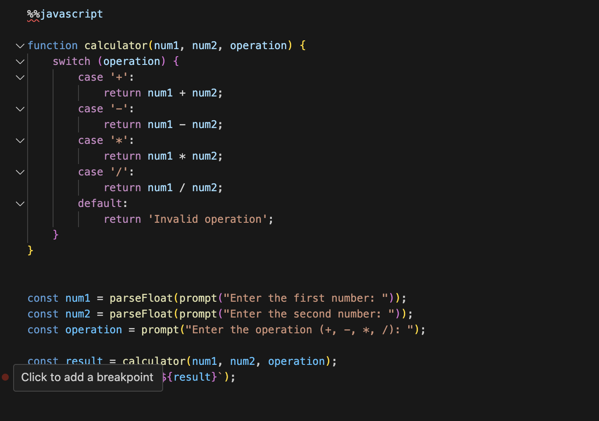
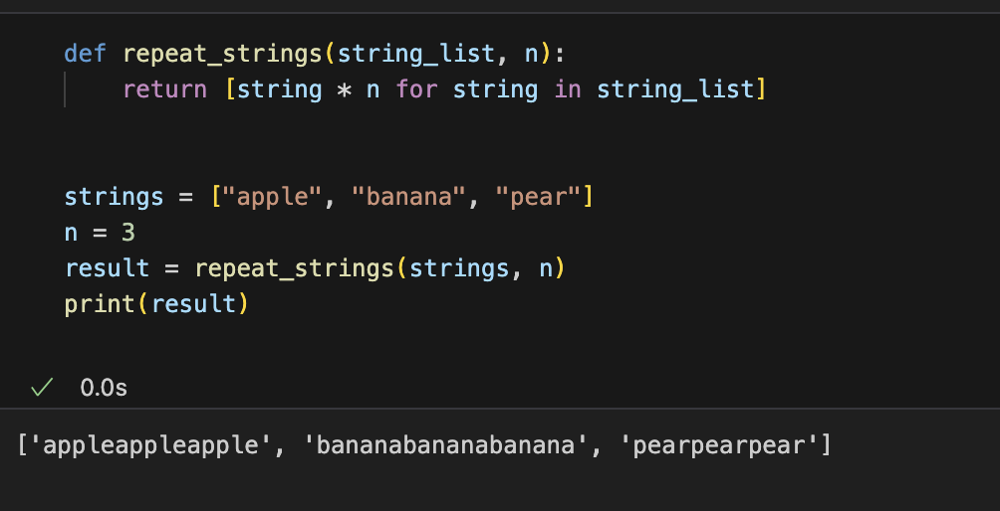
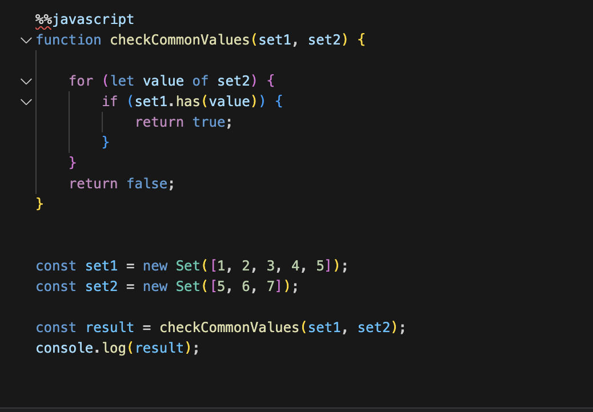



## SUMMARY OF 3.2 ##

### - The concept of Data Abstractions is basically how our computer is able to handle data structures and the computer being able to simplfy the structures ###
### - Integers are numbers that are postive, negative, and are not irrational(ex.30) ###
### - Floats do have decimial points and can be irriational (ex. pi) ###
### - Strings are normally pieces of code that have quotation marks around them and represent textual data(ex. "Lalita") ###
### - Lists are a collection of items all in one place, and normally are assigned with a variable( ex. Lalita = ["girl", "17", "yapper"]) ###
### - Tuples = Collection of data but cannot be changed with different data type (ex. coordinates) ###
### - Dictionaries are a collection of pairs where each thing corresponds to a value: (ex. Lalita = {"age": 17, "race": "indian"}) ###
### - Sets are collection of unique iteams and there are no repeating values ###

I think with my submission of the first 3.2 HW hack I had the wrong code, but I fixed it because that is the feed back I had gotten. I made a code that can list my hobbies and how much it would cost to do those hobbies. This was in Java and I also did it in python 

 This was a dictonary with fruits and I made the code output the first thing in the dictionary which was bananas 

The next hack was to make a calculator and I tried making it as unquie as possible, I tried coding it a different way in python but using different commands but still made sure for the output to be the same. 

 The next hack had to do with strings. This was repeating strings so I decided to stick with the theme of fruits. I made the computer say banana apple and pear three times 

The last one was to compare the values in the two sets. I tried doing phrases instead of numbers but for some reason the system couldn't output it correctly so I stuck with numbers. I tried adding more numbers and I did this in both java and python. 

