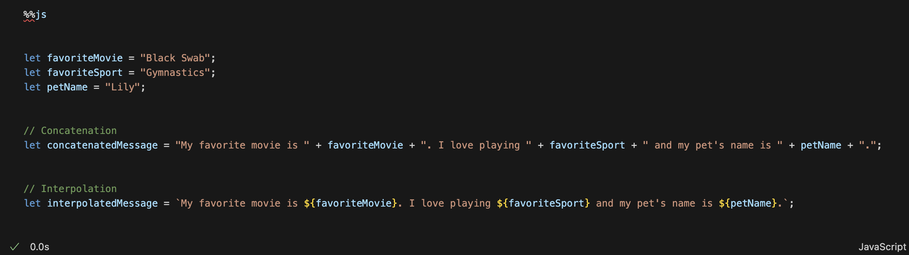
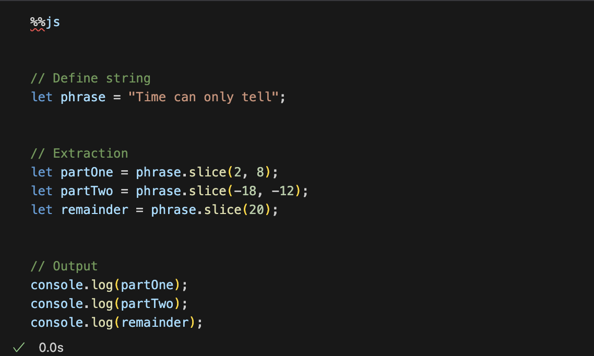
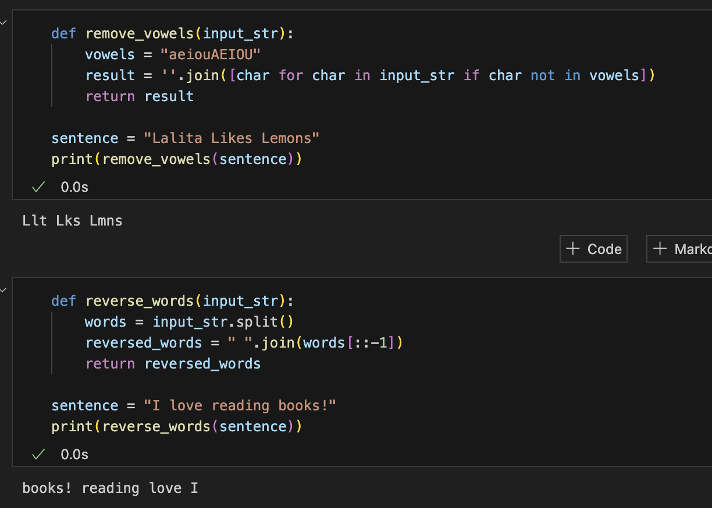
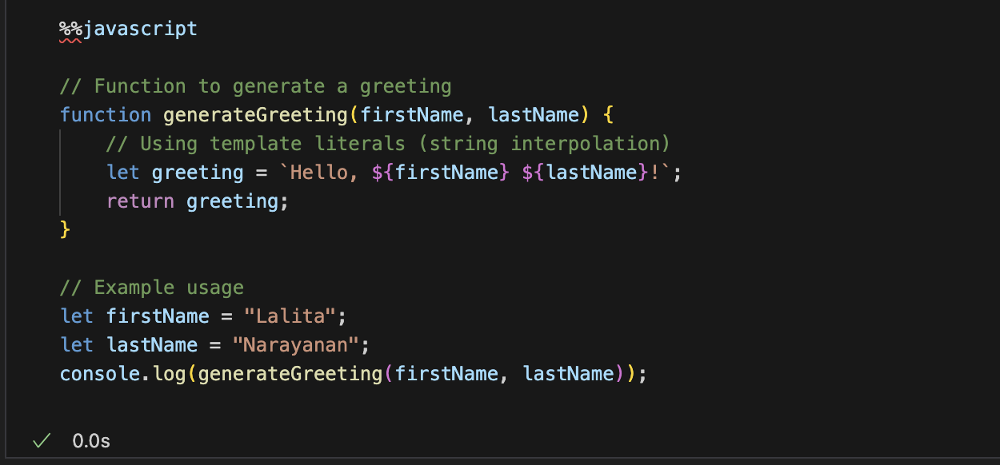
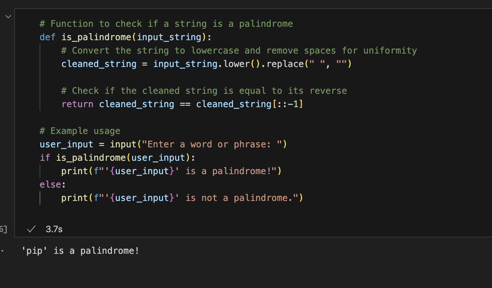



The first popcorn hack was to assign variables to a certian thing and then add that variable into phrases. I changed the variables to be assigned to what I personally like, and I changed them to my own type of variables. 

 This popcorn hack taught us how using python or java we can take parts of a phrase(that is a string) for the output. I made up a phrase and wrote code to make it cut certain phrases. 

 The last two popcorn hacks were to take out vowels and write a sentence backwards. I used my name and added it to a phrase and then removed the vowels and then I also made a phrase backwards using the reverse words function on python. 

 The first hack was to create an idea page and I did this on Javascript. I used the function generate greeting added my name and then it outputted a greeting that would say my name. 

The last hw hack was the palidrome test. There is a function called cleaned_string this checked to see if the string was the same forwards and backwards that this is what tests to see if this was going to be a palendrome or not. 

