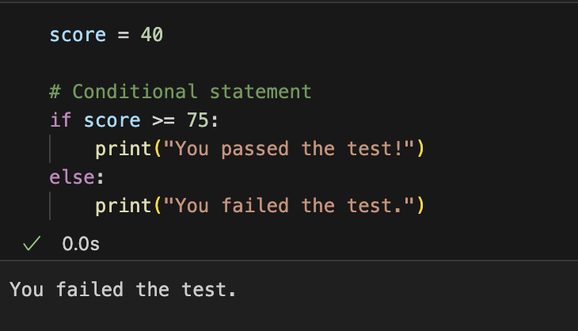
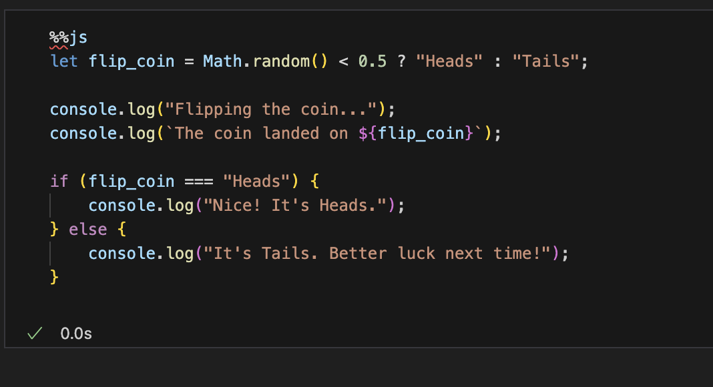
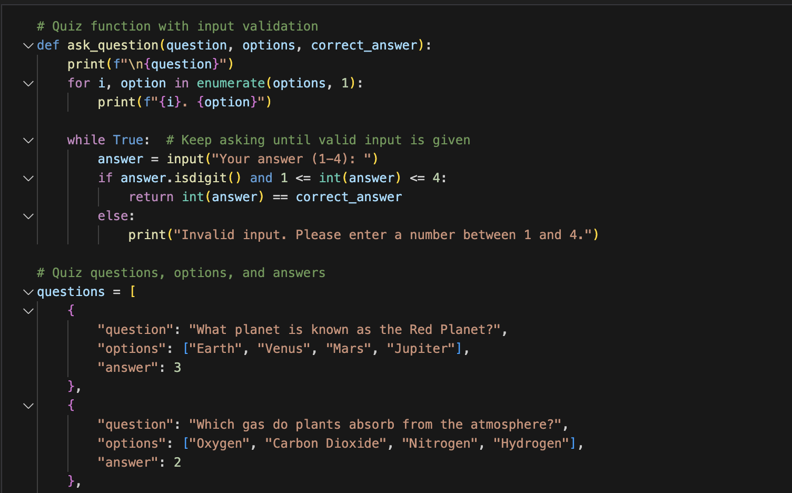
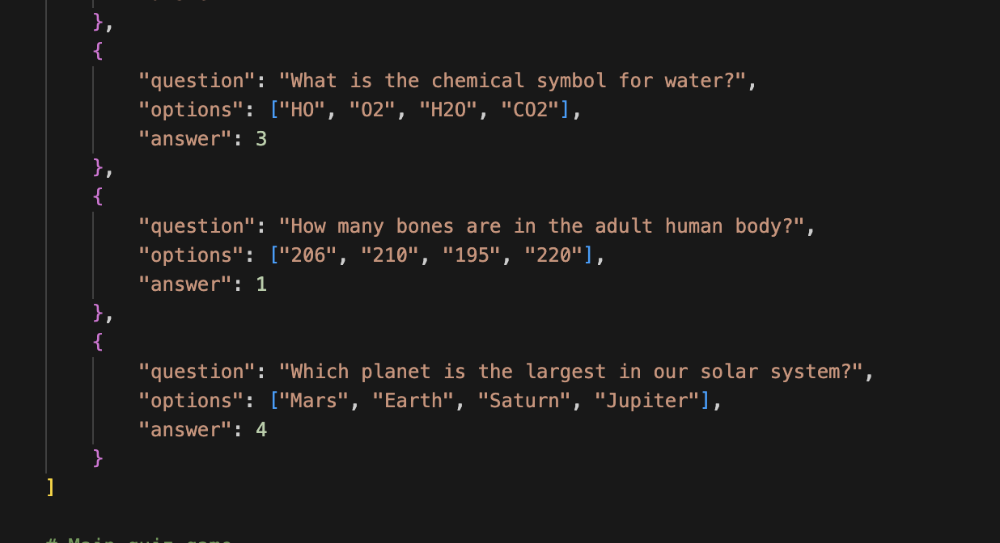
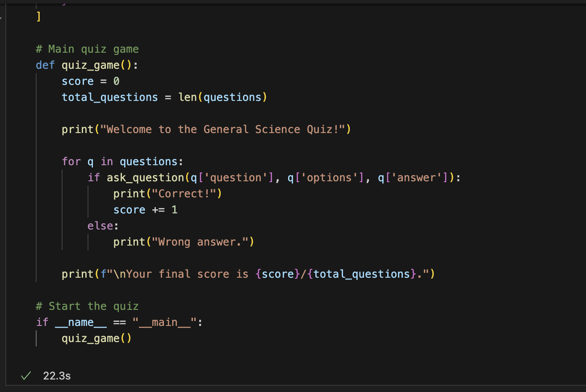
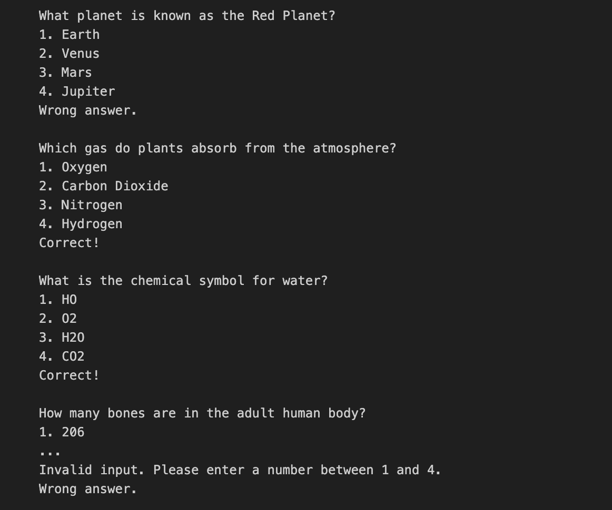



## SUMMARY OF 3.6 ##

### - With If else statements check certain condition and decide exceution is best to go with for each scenario. (ex. I am 17 so the code might say if >16: print(drive) else: print(cannot drive) since I am older than 16 mine will print can drive) ###

The first popcorn hack for 3.6 was to test to see if the user passed their test or not. With scores over a certain percent they passed other scores they failed. 

 The next popcorn hack was a coin flipper and this flips a coin and either gives heads or tails and I did this in javascript 

The homework hack was to create a multiple choice test and I did a science test. it gave 4 mc questions and after you input your answer it will tell you if you are right or wrong. 