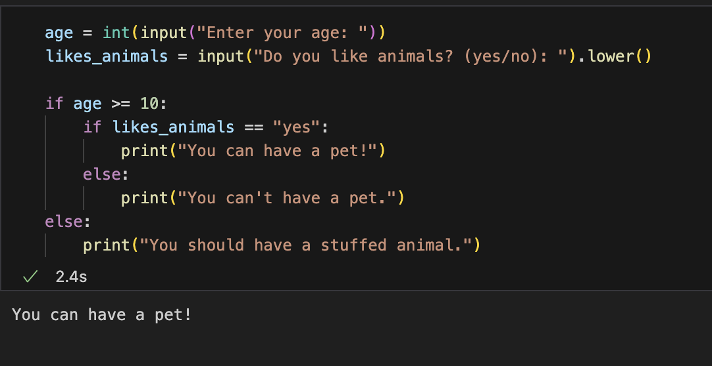
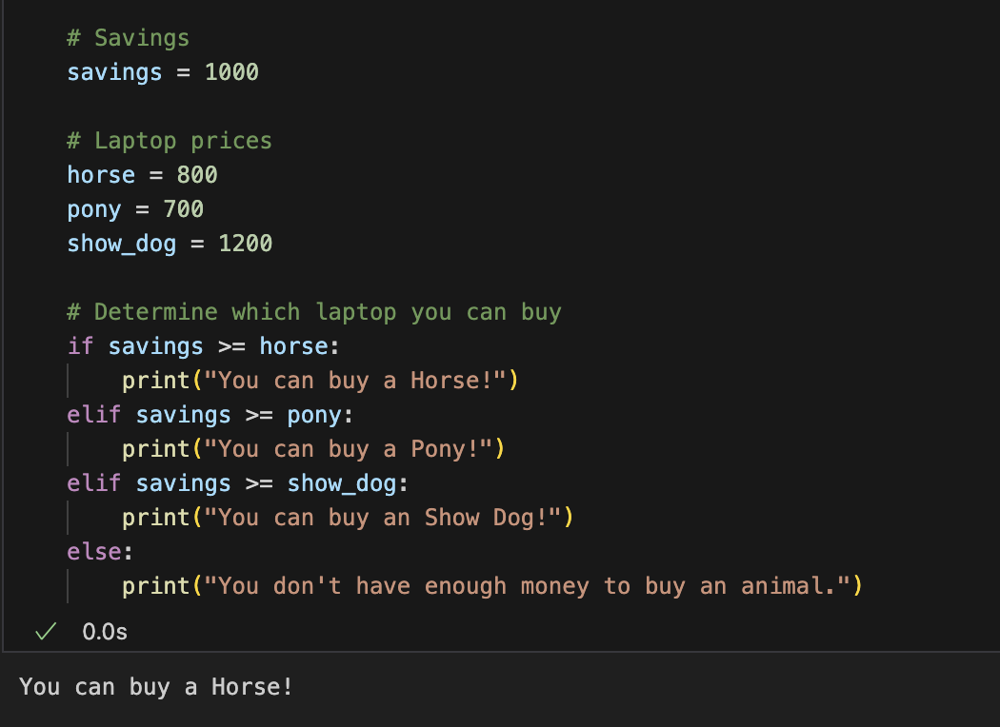
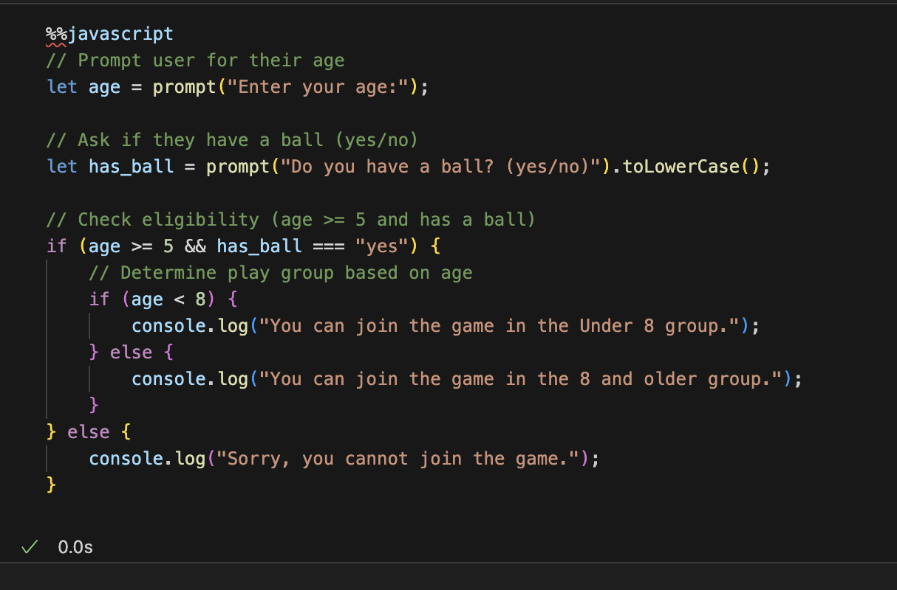



## SUMMARY OF 3.7##
### - Nested conidtionals allow for more if else statements within the if else statement. They allow for elif statements or under the if statement there can be another if else statement ###

 The first popcorn hack was letting us work with if else loops. I made an if else loop if someone can have a pet or not and I did this in python and java. 

 For this popcorn hack it taught me more with comparsion tools and the if else loops.It compared the savings value to the prices of the animals and then using the if else loops it said if we could buy the animals. 

One of the hw hacks is to do an if else statement with seeing if you could join a game. Based on the inputted age and if you have a ball you can or cannot join the game. 

