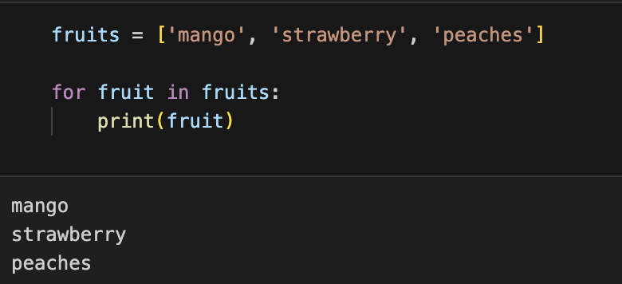
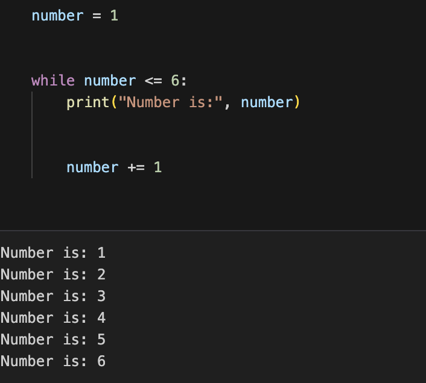
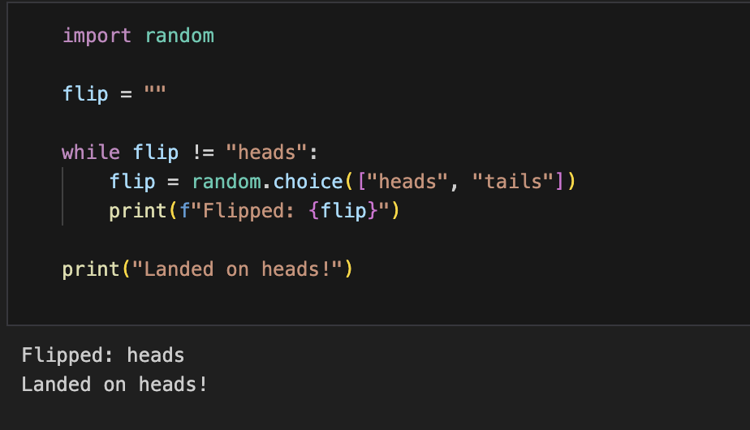
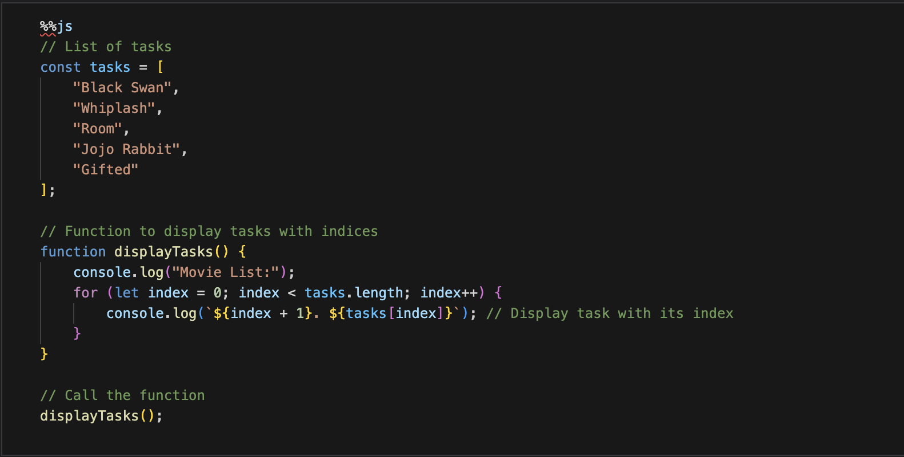
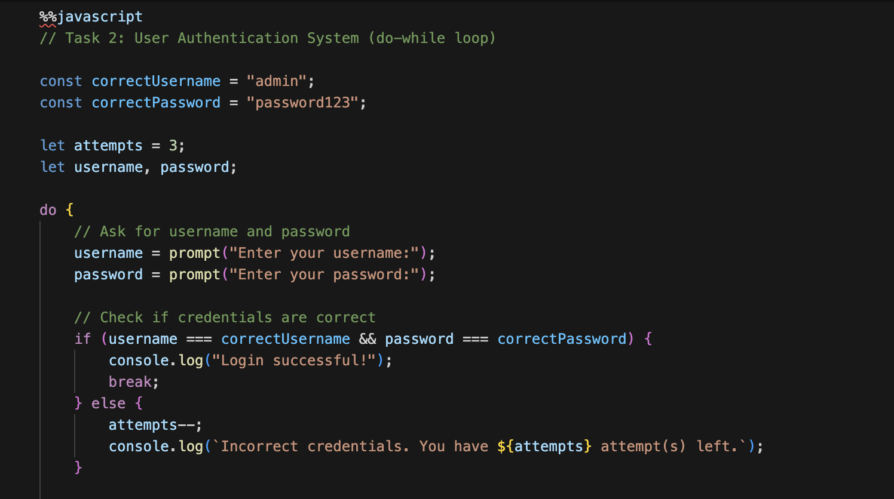
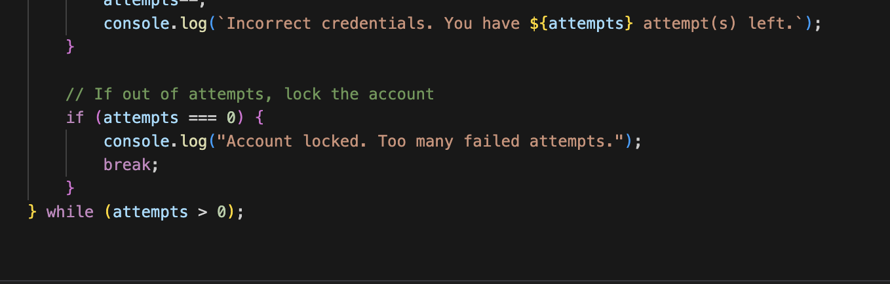



## SUMMARY OF 3.8 ##

### - For Loops: Used when you know how many times the loop should run.###
### - While Loops: Used when the loop should run until a condition becomes false.###
### -Do-While Loops:  Runs at least once, then checks the condition.###
### -Index Loops: A variation of for loops, used when you need access to the index.###
### -Break and Continue: Controls the loop flow by either stopping the loop (break) or skipping to the next iteration.###

 I made a list of fruits and using the for loop it was able to output each item in the list

 For this popcorn hack I used the while loop in order to print out each number between 1-6

 
 I imported random on python and then made a coin tosser on python with using the while loop 

 Made a list of tasks using python and the list of tasks I made was to make sure what movies I was watching. I used the for loop to output my list of tasks 

 This was the hack I was most proudest of. This hack I was able to alter it to my liking and  I tried and I used the application of the different loops we had leanred in order to do the code. Using different loops from this lesson and pervious lessons. 

